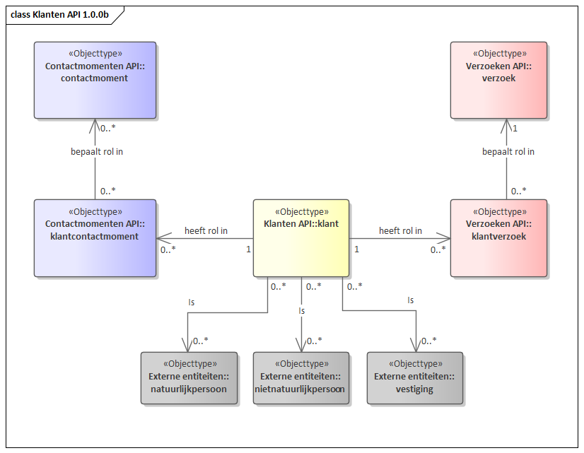

*WIP*

API voor opslag en ontsluiting van klanten en daarbij behorende metadata.

De API ondersteunt het opslaan en het naar andere applicaties ontsluiten van gegevens over klanten. 

## Gegevensmodel

Een klant wordt gedefinieerd als ...

Deze API ondersteunt het verwerken van gegevens van klanten inclusief de relatie met eventuele contactmoment(en) en/of verzoek(en).

### Relatie met contactmomenten

Een klant kan een rol hebben in een contactmoment. Vooralsnog zijn deze rollen `Belanghebbende` en `Gesprekspartner`. De relatie tussen klant en contactmoment is vastgelegd in `klantcontactmoment` in de Contactmomenten API.

### Relatie met verzoeken

Een klant kan een rol hebben bij een verzoek. Vooralsnog zijn deze rollen `Belanghebbende` en `Gesprekspartner`. De relatie tussen klant en contactmoment is vastgelegd in `verzoekcontactmoment` in de verzoeken API.

[{:width="1200px"}](Klanten API 1.0.0b.png "Klanten gegevensmodel - klik voor groot")

## Specificatie van de Contactmomenten API

* [Referentie-implementatie Klanten API](https://klanten-api.vng.cloud)
* API specificatie (OAS3) in
  [ReDoc](https://klanten-api.vng.cloud/api/v1/schema/),
  [Swagger](https://petstore.swagger.io/?url=https://klanten-api.vng.cloud/api/v1/schema/openapi.yaml),
  [YAML](https://klanten-api.vng.cloud/api/v1/schema/openapi.yaml) of
  [JSON](https://klanten-api.vng.cloud/api/v1/schema/openapi.json)

# Specificatie van gedrag

De Klanten API MOET aan twee aspecten voldoen:

* de OAS-specificatie `openapi.yaml` MOET volledig geïmplementeerd zijn.

* het run-time gedrag hieronder beschreven MOET correct geïmplementeerd zijn.

## Run-time gedrag

Bepaalde gedrageningen kunnen niet in een OAS spec uitgedrukt worden omdat ze businesslogica bevatten. Deze gedragingen zijn hieronder beschreven en MOETEN zoals beschreven geïmplementeerd worden.

### **<a name="kla-001">Garanderen uniciteit `bronorganisatie` en `klantnummer` van een KLANT ([kla-001](#kla-001))</a>**

Bij het aanmaken (`klant_create`) en bijwerken (`klant_update` en `klant_partial_update`) van een klant MOET gevalideerd worden dat de combinatie `bronorganisatie` en `klantnummer` uniek is, indien het `klantnummer` door de consumer meegestuurd wordt.

Indien het `klantnummer` niet door de consumer gestuurd wordt, dan MOET de Klanten API het nummer genereren op een manier die garandeert dat het uniek is binnen de bronorganisatie.

### **<a name="kla-002">Valideren attribuut `subject` bij aanmaken van een KLANT ([kla-002](#kla-002))</a>**

Bij het aanmaken van een KLANT (`klant_create`) MOET de URL-referentie naar SUBJECT gevalideerd worden op het bestaan indien deze is meegegeven en niet leeg is. Als het ophalen van de objecten niet (uiteindelijk) resulteert in een `HTTP 200` status code, MOET er geantwoord worden met een `HTTP 400` foutbericht. 

### HTTP-Caching

De Klanten API moet HTTP-Caching ondersteunen op basis van de `ETag` header. In de API spec staat beschreven voor welke resources dit van toepassing is. 

De `ETag` MOET worden berekend op de JSON-weergave van de resource. Verschillende, maar equivalente weergaves (bijvoorbeeld dezelfde API ontsloten wel/niet via NLX) MOETEN verschillende waarden voor de `ETag` hebben.

Indien de consumer een `HEAD` verzoek uitvoert op deze resources, dan MOET de provider antwoorden met dezelfde headers als bij een normale `GET`, dus inclusief de `ETag` header. Er MAG GEEN response body voorkomen.

Indien de consumer gebruik maakt van de `If-None-Match` header, met één of meerdere waarden voor de `ETag`, dan MOET de provider antwoorden met een `HTTP 304` bericht indien de huidige `ETag` waarde van de resource hierin voorkomt. Als de huidige `ETag` waarde hier niet in voorkomt, dan MOET de provider een normale `HTTP 200` response sturen.
